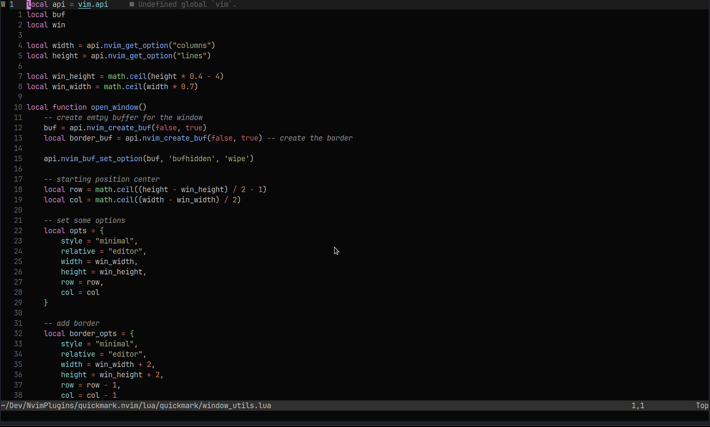

<div align="center">

# Quickmark.nvim
###### Quickly navigate your project 



</div>

# Installation

Using [packer.nvim](https://github.com/wbthomason/packer.nvim)

```lua
use('jmattaa/quickmark.nvim')

```

Using [vim-plug](https://github.com/junegunn/vim-plug)

```vim
Plug 'jmattaa/quickmark.nvim'
```

Using [lazy.nvim](https://github.com/folke/lazy.nvim)
```lua
--- in init.lua:
    {
        'jmattaa/quickmark.nvim'
    }

--- in plugins/quickmark.lua:
return {
    'jmattaa/quickmark.nvim'
}
```

# Usage

Use quickmark by typing `:Quickmark list<cr>` or by using the default keybinding `<leader>qq`
this will create a floating window and show all your quickmarks.

The quickmarks are not saved by default, you can save your quickmars for the project 
by using the default keybinding `<leader>qs` or
by typing the command `:Quickmarks save<cr>`.
This creates a file called *`.quickmarks`* in the directory you ran 
the `nvim` command in.

## To configure 

This is the default configuration. If you dont want to change it there is no need
to write the configuration

```lua
    require('quickmark').setup({
        key_mappings = {
            list = '<leader>qq',
            add = '<leader>qa',
            remove = '<leader>qr',
            remove_all = '<leader>qR',
            save = '<leader>qs',
            shortcut = '<leader>qn',
            open_shortcut = '<leader>qo',
        },
    })
```

You can call the `setup` function without parameters if you want the default 
keybindings. The `setup` function must be called to initialize quickmark if you
are not calling it in for example the `config` option of lazy.nvim the plugin 
will not initalize and it will be unusable. :(


For more run the `:help quickmark.usage` command

# Default Mappings

### Keystrokes in quickmarks window

The default keys you can use to navigate and handle the quickmaps window 

| Key              | Action                                               |
|------------------|------------------------------------------------------|
| q or Escape      | Close the quickmark window                           |
| j                | Move the cursor one line down                        |
| k                | Move the cursor one line up                          |
| Enter            | Open the selected file                               |

### Normal mode mappings

The default mappings that are available when you are in the vim normal mode
<br />
These mappings can be customized se ***[Usage](#usage)***

| Mappings         | Action                                               |
|:----------------:|------------------------------------------------------|
| \<leader\>qq     | List the quickmarks that you've added                |
| \<leader\>qa     | Add the current open file to your quickmarks list    |
| \<leader\>qr     | Remove the current open file from your quickmarks    |
| \<leader\>qR     | Empty the quickmarks list                            |
| \<leader\>qs     | Save the quickmars list in a `.quickmarks` file      |

# Shortcuts

A shortcut in `Quickmark` is a quick way to give the quickmarks a binding to 
quickly access it. To give a file a shortcut you can run 
`:Quickmark shortcut '<shortcut>'` where `<shortcut>` is the key you want to 
accociate the file with. The default binding for creating a shortcut is 
`<leader>qn<shortcut>`. Where `<shortcut>` is the key for the file.

To quickly move to the created shortcut use `<leader>qo<shortcut>`.

# Help
For more help you can find the full documentation in the `quickmark` docs by running `:help quickmark`

# Authors

- [@jmattaa](https://github.com/jmattaa)


